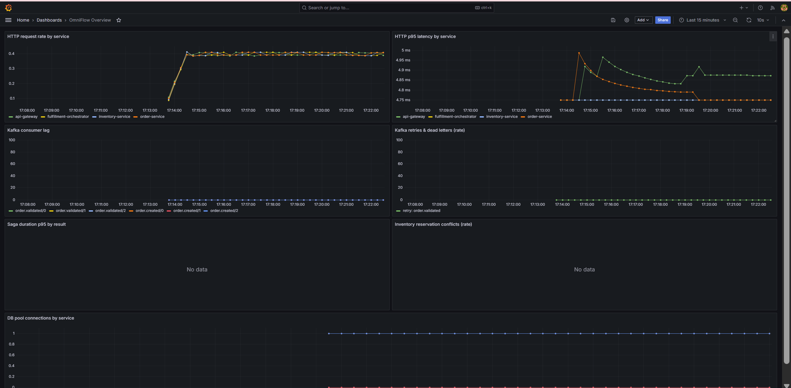
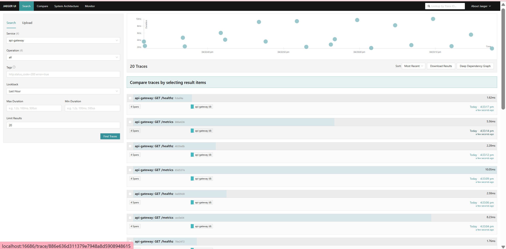
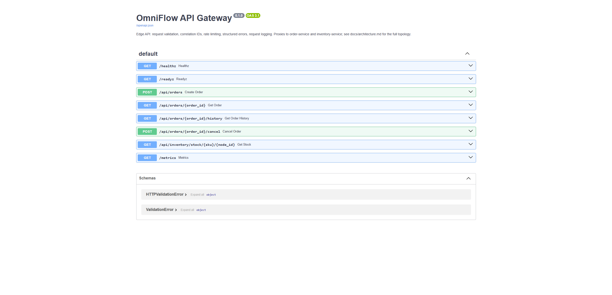

# OmniFlow

An event-driven retail order/inventory/fulfillment platform demonstrating
production-caliber distributed-systems and data-engineering practice — safe
concurrency, saga orchestration, a real event bus, and a Bronze/Silver/Gold
data pipeline — running entirely on a single machine with no paid cloud
services.

This is an original design. It is not a clone of, and does not use any
proprietary design, branding, or business information from, any real
retailer.

## Current implementation status

**Phases 1-6 of 13 are done and verified** (Phase 5, Data quality, is also
done — folded into Phase 4). **Phases 7, 8, 11, 13 have not been started**;
parts of 9, 10, and 12 have been pulled forward as a separate engineering-
quality pass, and the Phase 4 streaming data platform has had a hardening
pass on top (see below).

| Done now | Not started yet |
|---|---|
| Core domain (orders, inventory, API gateway) | Ops dashboard (React/TypeScript) |
| Event platform (Redpanda, saga orchestrator, DLQ, replay) | Failure laboratory |
| Observability (structured logs, tracing, metrics, Grafana) | JWT/RBAC, load testing, Terraform, career docs |
| Data platform (Spark Bronze/Silver/Gold, data quality, backfill, malformed-event quarantine, Spark job metrics) | An actual GitHub-hosted CI run (workflow authored + verified locally only) |
| Demand forecasting (synthetic history, seasonal-naive baseline, `HistGradientBoostingRegressor` secondary model, chronological evaluation, champion selection, future forecasts) | |
| Measured coverage threshold, security scanning, pre-commit, CI (`docs/phase-5-engineering-quality.md`) | |

Data quality (checks + report) was originally scoped as its own phase but was
folded into Phase 4, since the Spark plumbing it depends on was already in
place. The engineering-quality pass reuses the number "Phase 5" in its
branch name by coincidence — it is not that phase; see
`docs/phase-5-engineering-quality.md` for the naming note. A separate
streaming-data-platform hardening pass similarly reused "Phase 6" in its own
branch name by coincidence — this branch (`phase-6-demand-forecasting`) is
the table's actual Phase 6; see `docs/phase-6-streaming-data-platform.md`
for that unrelated hardening pass and `docs/phase-6-demand-forecasting.md`
for this one. Full phase-by-phase detail: `PROJECT_STATUS.md`.

## Verified proof points

Every number below comes from a command actually run against this repo (see
`TEST_RESULTS.md`; nothing here is estimated) or from a real
`docker compose up` verified in `PROJECT_STATUS.md`:

- **272 tests passing, 0 failing** across six suites (event-contracts,
  order-service, inventory-service, fulfillment-orchestrator, api-gateway,
  data-platform — including 91 new forecasting tests)
- **23 containers** (full app stack + Redpanda + MinIO + Spark + observability
  stack) running concurrently on one host without OOM
- **11 event types** in the event catalog, each with a schema and a consumer
  idempotency guarantee
- **10 Gold datasets** (9 Spark streaming aggregations + 1 directly-polled
  consumer-lag dataset)
- **Real Kafka → Bronze → Silver → Gold flow verified end-to-end**: synthetic
  traffic generated onto real topics, real Parquet observed at every layer,
  a data-quality report run against live MinIO data (overall PASS), and all
  10 Gold datasets successfully backfilled from real Silver data
- **Demand forecasting, measured honestly**: on this session's deterministic
  smoke-test run, the secondary model (`HistGradientBoostingRegressor`,
  WAPE 0.154) genuinely beat the seasonal-naive baseline (WAPE 0.298) and
  was selected champion by a documented rule using the measured numbers —
  full detail: `docs/phase-6-demand-forecasting.md`
- **73.4% measured combined test coverage** across all six suites, a 65%
  threshold enforced by `make coverage` and `coverage.xml` generated at the
  repo root; `make security` (bandit + pip-audit) runs clean, with every
  accepted CVE individually justified in `RISKS.md` #20 — full detail:
  `docs/phase-5-engineering-quality.md`

## Verified engineering highlights

- **Idempotent APIs**: every consumer dedupes by `event_id`
  (`processed_events`); `POST /api/orders` safely retries via an
  `Idempotency-Key` header — proven with a real duplicate-request test.
- **Two deliberate concurrency strategies** by contention profile: row-level
  locking for hot `inventory_stock` rows, optimistic `version` columns for
  low-contention `orders` ([ADR 0002](docs/adrs/0002-inventory-concurrency-control.md)).
  Verified live: 10 threads racing for 1 unit of stock, exactly 1 succeeds.
- **Real saga compensation**: a live compose run forced a payment decline and
  confirmed the released inventory reservation was actually restored in
  Postgres, not just marked failed.
- **Tracing that survives the Kafka boundary**: one Jaeger trace, manually
  inspected, covers a single order across the gateway, order service, and
  orchestrator's async saga steps.
- **Twelve real bugs found and fixed by actually running the system** (Spark
  scheduler starvation, MinIO's bulk-delete rejection, a Structured Streaming
  metadata-visibility gap, a dedup watermark declared on the wrong timestamp
  column silently dropping valid rows, a recursive-forecast row-ordering bug
  caught by a regression test before it ever shipped, and more) — full
  writeups in `DECISIONS.md`.

## Architecture overview

An API Gateway fronts an Order Service and Inventory Service
(Postgres-backed); a Fulfillment Orchestrator runs the order saga by
consuming events off a Redpanda (Kafka-protocol) event bus and calling
Order/Inventory directly over REST for each step
([ADR 0001](docs/adrs/0001-redpanda-over-kafka.md),
[ADR 0004](docs/adrs/0004-custom-saga-orchestrator.md),
[ADR 0010](docs/adrs/0010-node-scoring-and-saga-orchestration.md)); a PySpark
Structured Streaming pipeline turns the same event catalog into
Bronze/Silver/Gold datasets in MinIO
([ADR 0005](docs/adrs/0005-spark-local-mode.md)); Jaeger, Prometheus, and
Grafana make the request/event path observable. Full container and sequence
diagrams (including the target-state ops dashboard, not yet built):
`docs/architecture.md`.

## Implemented capabilities

- Order lifecycle state machine (`CREATED → VALIDATED → INVENTORY_PENDING →
  INVENTORY_RESERVED → FULFILLMENT_ASSIGNED → PROCESSING → SHIPPED`, plus
  `CANCELLED`/`FAILED`) with idempotent creation and optimistic-versioned
  transitions.
- Row-locked inventory reservation with a stock-check endpoint and
  fulfillment-node scoring.
- A custom saga orchestrator: node scoring, deterministic payment simulation,
  compensation on failure, retry with backoff+jitter, dead-letter routing,
  and a replay CLI for reprocessing dead letters after a fix.
- Transactional outbox on every event-producing service, so an event is never
  published without the state change that caused it having already committed
  ([ADR 0003](docs/adrs/0003-transactional-outbox.md)).

## Data platform

PySpark Structured Streaming (`local[*]`, single-node) reads all 11
event-catalog topics into Bronze (immutable raw Parquet, with malformed/
unparseable Kafka records quarantined to their own path rather than
written with null envelope fields), validates and deduplicates into Silver
(rejects and late events routed to their own paths, never dropped
silently), and aggregates into 10 Gold datasets. Also included: a synthetic
event generator with configurable duplicate/late-event/malformed-record
injection, an executable data-quality suite (reconciliation, rejection
rate, duplicate rate, lateness, freshness) with a JSON report, batch
backfill/reprocessing tooling with row-count validation before swapping
into the live path, a MinIO data-lake inspection CLI, and an end-to-end
smoke test (`make phase6-smoke`). Full design: `docs/data-pipeline.md`,
`docs/phase-6-streaming-data-platform.md`.

## Demand forecasting

A pandas/scikit-learn batch pipeline (`services/data-platform/app/
forecasting`, no Spark/JVM needed) over a deterministic synthetic demand
history (SKU x location x date grain — the real event catalog has no
location attribution to build this from yet, and live volume is too small
either way, both confirmed before building anything): feature engineering
with tested leakage safeguards, a seasonal-naive baseline, a
`HistGradientBoostingRegressor` secondary model, chronological (never
random) evaluation with rolling-origin walk-forward folds, MAE/RMSE/WAPE
computed from real predictions, a documented measured champion-selection
rule, recursive multi-step future forecasts, and local model-artifact
persistence. Full CLI (`python -m app.forecasting.cli`), 12
`make forecast-*` targets, and an end-to-end local smoke test
(`make forecast-smoke`, no live MinIO/Kafka needed). Full design:
`docs/phase-6-demand-forecasting.md`, [ADR 0006](docs/adrs/0006-forecasting-scope.md).

## Observability

Structured JSON logs with `correlation_id` on every line; OpenTelemetry
tracing pushed to Jaeger, with trace context carried across the Kafka
boundary in the event envelope itself; Prometheus metrics pulled from every
FastAPI service, every background worker, and every Spark bronze/silver/
gold job (`data_platform_batch_rows_total`/`data_platform_batch_duration_seconds`);
a provisioned Grafana dashboard (request rate/latency, Kafka lag/retries/
DLQ, saga duration, DB pool).

## Verified test and environment evidence

Host: Docker 29.6.2 + Compose v5.3.1, 8 CPUs, 15Gi RAM, ~950G disk. No host
Python/Node/Java/Terraform — every build, test, and lint command runs inside
a container.

| Suite | Passed | Failed |
|---|---|---|
| event-contracts | 37 | 0 |
| order-service | 34 | 0 |
| inventory-service | 18 | 0 |
| fulfillment-orchestrator | 29 | 0 |
| api-gateway | 9 | 0 |
| data-platform | 145 | 0 |
| **Total** | **272** | **0** |

data-platform's 145 includes 91 forecasting tests (`tests/forecasting/`) —
unit tests for synthetic-data determinism, feature/leakage correctness,
data-quality checks, chronological splits, both models, metrics, champion
selection, and artifact persistence, plus pipeline tests for dataset
preparation and a full end-to-end CLI run.

Also verified against a real, freshly-started `docker compose up`: the full
order lifecycle end to end (including the payment-decline/compensation
path), traces landing in Jaeger, all Prometheus scrape targets up with real
samples, the Grafana dashboard provisioned, and (Phase 4) real Bronze/
Silver/Gold Parquet plus a passing data-quality report. `mypy` passes clean
across all six packages; `ruff check`/`ruff format --check` pass clean. Full
detail, including every bug found and fixed while producing these numbers:
`TEST_RESULTS.md`.

**Engineering quality** (`make ci`, exit 0): combined coverage 73.4%
(threshold 65%, `coverage.xml` generated), `bandit` 0 medium/high,
`pip-audit` clean after fixing 5 CVEs outright and individually accepting 9
with a written, verified reason each (`RISKS.md` #20), `docker compose
config` valid, all five application images build. Full detail:
`docs/phase-5-engineering-quality.md`.

## Quick-start instructions

Requires only Docker + Docker Compose — no paid services, no host Python/
Node/Java/Terraform.

```bash
cp .env.example .env
make demo        # docker compose up --build, then prints the service URLs
```

Other useful targets:

```bash
make test         # all six service test suites, each against its own *_test database
make typecheck    # mypy, per service
make lint         # ruff check
make format       # ruff format
make migrate      # apply Alembic migrations
make smoke        # end-to-end order lifecycle + observability verification
make generate     # run the synthetic event generator against the live stack
make dq-report    # run the data-quality report against live MinIO data
make backfill     # Silver/Gold backfill and reprocessing tooling
make phase6-smoke # end-to-end data-platform smoke test (generate -> bronze -> silver -> gold -> dq-report)
make inspect-bronze / inspect-silver / inspect-gold / inspect-bronze-rejects / inspect-silver-rejects / inspect-late-events
                  # inspect MinIO data-lake prefixes from the command line
make forecast-run     # full demand-forecasting pipeline: generate -> prepare -> train both models -> evaluate -> select -> forecast
make forecast-smoke   # end-to-end forecasting smoke test, entirely local (no live MinIO/Kafka needed)
make forecast-inspect ARGS="forecast"  # inspect forecast output / metrics / selection / dataset
make reset        # tear down containers and volumes for a clean slate
make logs         # tail all service logs

make setup-dev    # build the shared devtools image (once, or after editing it)
make coverage     # all six suites w/ coverage, combined coverage.xml, threshold-enforced
make security     # bandit (SAST) + pip-audit (dependency CVEs)
make pre-commit   # pre-commit hooks against the whole tree
make docker-validate  # docker compose config
make docker-build     # build all five application images
make ci           # the full local gate: format-check, lint, typecheck, coverage, security, docker
make help         # list every target with its description
```

## Project Screenshots







## Important service URLs

Available once `make demo` reports all services healthy:

| Service | URL |
|---|---|
| API Gateway (start here) | http://localhost:8080/docs |
| Order Service (direct) | http://localhost:8001/docs |
| Inventory Service (direct) | http://localhost:8002/docs |
| Fulfillment Orchestrator (direct) | http://localhost:8003/docs |
| Jaeger (distributed traces) | http://localhost:16686 |
| Prometheus (metrics) | http://localhost:9090 |
| Grafana (dashboards, anonymous admin access) | http://localhost:3000 |
| MinIO Console (bronze/silver/gold browser) | http://localhost:9001 |

## Repository structure

```
services/
  api-gateway/            FastAPI edge service (authn/z, rate limiting, proxy)
  order-service/           Order state machine, outbox, validator consumer
  inventory-service/       Stock, reservations, row-level locking
  fulfillment-orchestrator/ Saga engine, node scoring, payment sim, DLQ, replay
  event-contracts/         Shared Kafka helpers, schemas, logging/tracing/metrics setup
  data-platform/            Spark Bronze/Silver/Gold, DQ, generator, backfill, forecasting
infra/docker/               Compose service configs (Grafana, Prometheus, MinIO, Redpanda, OTel,
                             devtools — the shared ruff/mypy/pytest/bandit/pip-audit/pre-commit image)
.github/workflows/           ci.yml — GitHub Actions, mirrors `make ci`
docs/                       Architecture, event catalog, data model, data pipeline, ADRs,
                             phase-5-engineering-quality.md
scripts/                    compose_smoke_test.sh (make smoke)
docker-compose.yml, Makefile, .env.example, .pre-commit-config.yaml
PROJECT_STATUS.md, RISKS.md, DECISIONS.md, TEST_RESULTS.md
```

## Architecture decisions worth reviewing

| ADR | Decision |
|---|---|
| [0001](docs/adrs/0001-redpanda-over-kafka.md) | Redpanda over Apache Kafka |
| [0002](docs/adrs/0002-inventory-concurrency-control.md) | Row-locking vs. optimistic versioning, by contention profile |
| [0003](docs/adrs/0003-transactional-outbox.md) | Transactional outbox over CDC/Debezium |
| [0004](docs/adrs/0004-custom-saga-orchestrator.md) | Custom lightweight saga orchestrator over Temporal/Airflow |
| [0005](docs/adrs/0005-spark-local-mode.md) | PySpark Structured Streaming, single-node `local[*]` |
| [0006](docs/adrs/0006-forecasting-scope.md) | Demand forecasting: baseline first, lightweight secondary model |
| [0007](docs/adrs/0007-terraform-not-applied.md) | Terraform authored + validated, never applied |
| [0010](docs/adrs/0010-node-scoring-and-saga-orchestration.md) | Node-scoring formula, direct-REST saga coordination |

Full index of all 10 ADRs: `docs/adrs/README.md`.

## Known limitations

- **Saga resume gap**: a crash between a successful remote reservation and
  the saga's local commit of that step leaves no local record — fails loudly
  rather than double-reserving or guessing. Accepted, not solved (`RISKS.md` #11).
- **`--once` mode's final Silver micro-batch can leave a real,
  non-self-healing reconciliation gap** (verified: doesn't clear even after
  25+ minutes past the watermark) — `Trigger.AvailableNow()` gives no
  guaranteed flush cycle for a watermark-gated stateful operator's last
  batch. Not source data loss (Bronze/Kafka still have it); recovered via
  `app.backfill silver --apply` (`RISKS.md` #22).
- **Single-instance-only gateway**: in-process rate limiting and per-process
  DB pooling, would not survive horizontal scaling without a shared backing
  store (`RISKS.md` #13).
- **Grafana and worker `/metrics` are unauthenticated** — fine for a local
  demo, first thing to change before any shared deployment (`RISKS.md` #14).
- **Custom saga orchestrator, not a proven framework** — less battle-tested
  than Temporal; a deliberate scope tradeoff (`RISKS.md` #8).
- **9 dependency CVEs accepted, not fixed** — mostly `starlette` (pulled in
  transitively by `fastapi==0.115.0`); the real fix needs a coordinated
  `fastapi`/`starlette` major-version upgrade across all four HTTP services,
  verified incompatible with the current pin and scoped as its own
  follow-up rather than a same-pass bump (`RISKS.md` #20).
- **Coverage is statement-only, not branch**, despite `pyproject.toml`
  declaring branch coverage on — each service's own test container lacks
  the repo-root `pyproject.toml` at collection time
  (`docs/phase-5-engineering-quality.md`).
- **Demand forecasting is bounded by synthetic data's realism**, and its
  recursive multi-step future-forecast rollout has no native multi-horizon
  head — step-to-step prediction error can compound across the horizon.
  Both documented, not glossed over (`docs/phase-6-demand-forecasting.md`
  'Limitations').

Full risk register, with status and mitigation for each: `RISKS.md`.

## Remaining roadmap

Phases 7, 8, 11, and 13 not yet started: a React/TypeScript ops dashboard,
a failure laboratory (10 deterministic scenarios), AWS infrastructure in
Terraform (authored/validated only, per
[ADR 0007](docs/adrs/0007-terraform-not-applied.md)), and final
documentation/career deliverables. Phases 9, 10, and 12 are partially
done — a coverage threshold, security scanning, and a CI workflow landed in
`docs/phase-5-engineering-quality.md`, but JWT/RBAC, load testing, and an
actual GitHub-hosted CI run remain open. Full scope per phase:
`PROJECT_STATUS.md`.

## License status

No `LICENSE` file exists yet. One is planned alongside the rest of the
documentation set in Phase 13.
