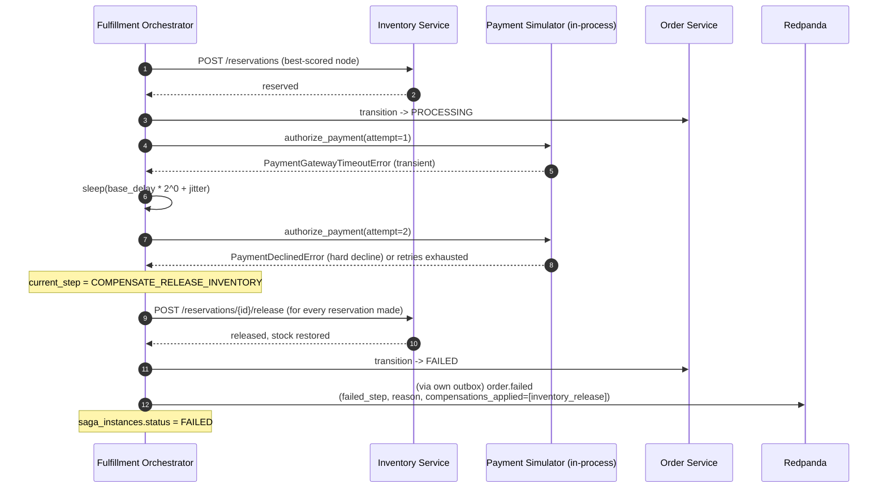
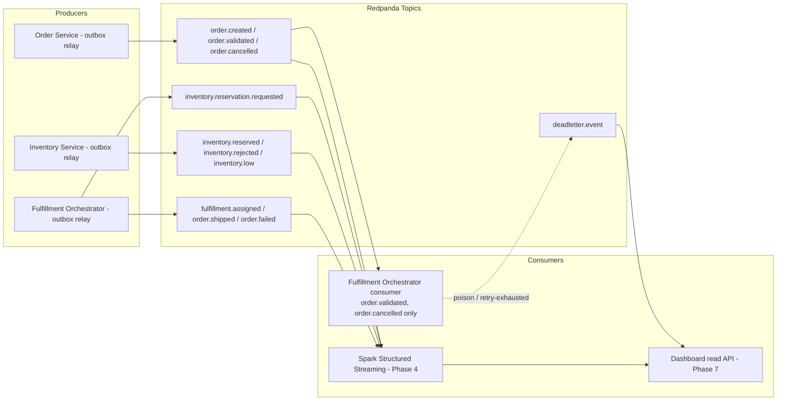
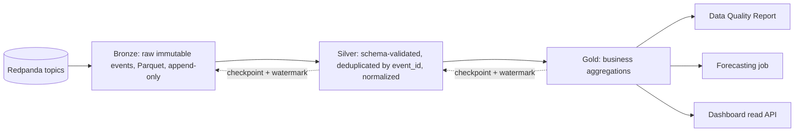
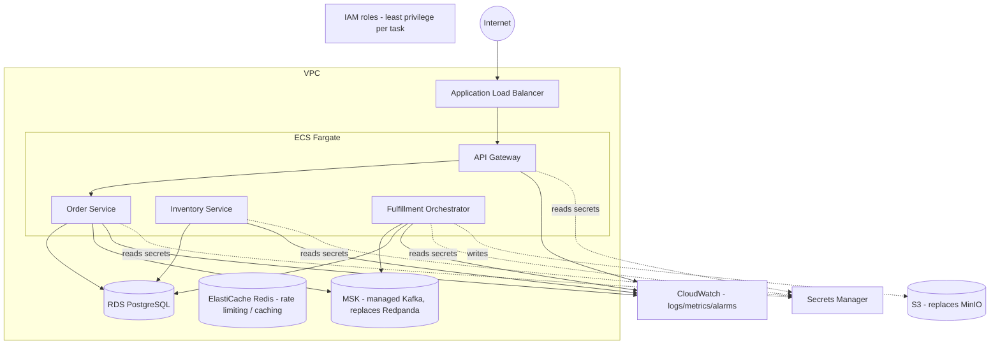
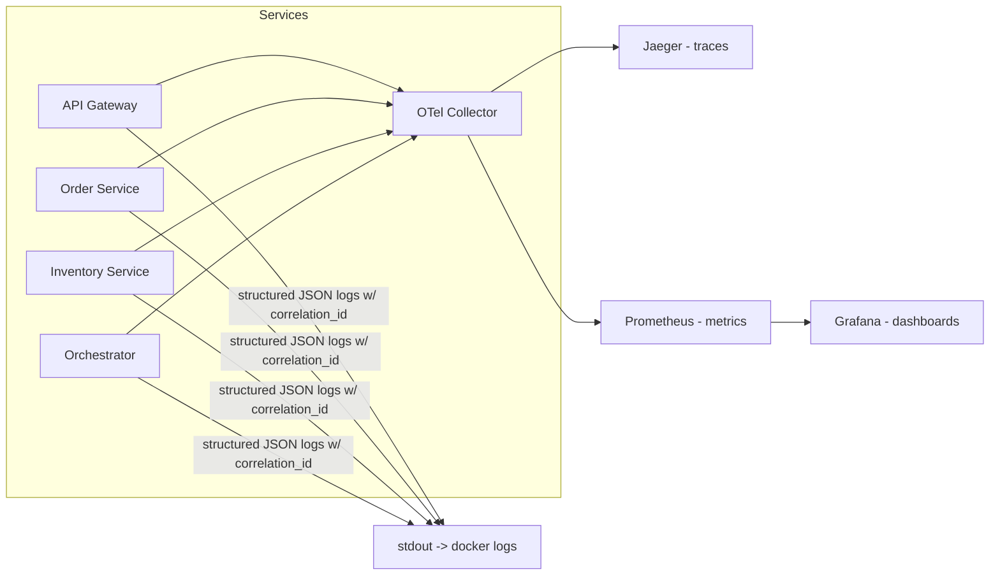

# Architecture

See `docs/system-context.md` for the external view. This document covers the
inside of the boundary: containers/services, the request and event flows
between them, the data pipeline, the AWS deployment target, and the
observability flow. Service boundaries mirror the monorepo layout in
`PROJECT_STATUS.md` / the root `README.md`.

## Container architecture

```mermaid
C4Container
  title OmniFlow — Container Diagram

  Person(customer, "Customer / load generator")
  Person(ops, "Ops user")

  System_Boundary(omniflow, "OmniFlow") {
    Container(gateway, "API Gateway", "FastAPI", "AuthN/Z, validation, rate limiting, correlation IDs, OpenAPI")
    Container(orders, "Order Service", "FastAPI + SQLAlchemy", "Order state machine, idempotency, outbox")
    Container(inventory, "Inventory Service", "FastAPI + SQLAlchemy", "Stock, reservations, row-level locking")
    Container(orchestrator, "Fulfillment Orchestrator", "Python + Kafka consumer", "Saga: node selection, payment sim, compensation")
    Container(payment_sim, "Payment Simulator", "Python module, in-process within the orchestrator", "Deterministic authorize/decline/timeout — not a separate deployable")
    ContainerDb(postgres, "PostgreSQL", "RDBMS", "Orders, inventory, outbox, saga state, users, audit")
    Container(redpanda, "Redpanda", "Kafka-protocol broker", "Domain event bus + DLQ topics")
    Container(outbox_relay, "Outbox Relay", "Python worker", "Polls outbox_events, publishes to Redpanda")
    Container(spark, "Spark Structured Streaming", "PySpark, local[*]", "Bronze/Silver/Gold pipeline")
    ContainerDb(minio, "MinIO", "S3-compatible object store", "Parquet: bronze/silver/gold")
    Container(dq, "Data Quality Runner", "Python + PySpark", "Executable checks, report generation")
    Container(forecast, "Forecasting Job", "Python (scikit-learn/statsmodels)", "Baseline + model, batch")
    Container(dashboard, "Ops Dashboard", "React + TypeScript", "Executive, ops, DQ, forecast, failure-lab UIs")
    Container(otel_collector, "OTel Collector", "OpenTelemetry", "Trace/metric pipeline")
    ContainerDb(prometheus, "Prometheus", "TSDB", "Metrics")
    Container(grafana, "Grafana", "Dashboards")
    Container(jaeger, "Jaeger", "Trace storage/UI")
  }

  Rel(customer, gateway, "HTTPS/JSON")
  Rel(ops, dashboard, "HTTPS")
  Rel(dashboard, gateway, "REST (read/write) + polling", "HTTPS")
  Rel(gateway, orders, "REST (internal)")
  Rel(gateway, inventory, "REST (internal, read-only queries)")
  Rel(orders, postgres, "SQL")
  Rel(inventory, postgres, "SQL")
  Rel(orders, outbox_relay, "writes outbox_events row in same TX", "via postgres")
  Rel(outbox_relay, redpanda, "produces events")
  Rel(orchestrator, redpanda, "consumes order.validated/order.cancelled; produces its own events", "Kafka")
  Rel(orchestrator, orders, "GET order, transition status", "REST")
  Rel(orchestrator, inventory, "list nodes, check stock, reserve/release", "REST")
  Rel(orchestrator, payment_sim, "authorize", "in-process call")
  Rel(orchestrator, postgres, "saga_instances", "SQL")
  Rel(spark, redpanda, "consumes all topics")
  Rel(spark, minio, "writes/reads Parquet")
  Rel(dq, minio, "reads Silver/Gold, writes DQ report")
  Rel(forecast, minio, "reads Gold, writes forecast dataset")
  Rel(dashboard, minio, "reads DQ report / forecast / gold summaries", "via a thin read API")
  Rel(gateway, otel_collector, "traces")
  Rel(orders, otel_collector, "traces")
  Rel(inventory, otel_collector, "traces")
  Rel(orchestrator, otel_collector, "traces")
  Rel(otel_collector, jaeger, "traces")
  Rel(otel_collector, prometheus, "metrics")
  Rel(grafana, prometheus, "queries")
```



## Order sequence (happy path)

As built (see ADR 0010): the orchestrator's Kafka consumption is what
*starts* the saga (`order.validated`) and is genuinely idempotent/resumable,
but once running, each step is a direct, synchronous REST call to Order
Service or Inventory Service — not a second event round-trip. Every service
still publishes its full event catalog via its own outbox for the data
platform and dashboard; those publishes are shown but are not what drives
the next step.

```mermaid
sequenceDiagram
  autonumber
  participant C as Customer
  participant GW as API Gateway
  participant OS as Order Service
  participant OBX as Outbox Relay
  participant RP as Redpanda
  participant ORCH as Fulfillment Orchestrator
  participant INV as Inventory Service
  participant PAY as Payment Simulator (in-process)

  C->>GW: POST /orders (Idempotency-Key, correlation-id)
  GW->>OS: create order (validated payload)
  alt key seen before, same hash
    OS-->>GW: 200 (cached response)
  else new key
    OS->>OS: BEGIN; insert order (CREATED); self-validate -> VALIDATED;<br/>outbox: order.created, order.validated; COMMIT
    OS-->>GW: 201 Created (status: CREATED)
    OBX->>RP: publish order.created, order.validated
    RP-->>ORCH: order.validated (saga trigger; idempotent on event_id)
    ORCH->>OS: GET order; transition -> INVENTORY_PENDING
    ORCH->>INV: GET /fulfillment-nodes; POST /stock/check per candidate
    ORCH->>RP: (via own outbox) inventory.reservation.requested
    ORCH->>ORCH: score candidates (ADR 0010)
    ORCH->>INV: POST /reservations (best-scored node, per item)
    INV-->>ORCH: reserved (row-locked; ADR 0002)
    INV->>RP: (via own outbox) inventory.reserved
    ORCH->>OS: transition -> INVENTORY_RESERVED -> FULFILLMENT_ASSIGNED(node_id)
    ORCH->>RP: (via own outbox) fulfillment.assigned
    ORCH->>OS: transition -> PROCESSING
    ORCH->>PAY: authorize_payment(order_total, skus, attempt)
    PAY-->>ORCH: approved
    ORCH->>OS: transition -> SHIPPED
    ORCH->>RP: (via own outbox) order.shipped
    Note over ORCH: saga_instances.status = COMPLETED
  end
```

## Inventory reservation under concurrency

```mermaid
sequenceDiagram
  autonumber
  participant A as Request A (last unit)
  participant B as Request B (last unit)
  participant DB as Postgres (inventory_stock row)

  par concurrent requests for same SKU/node
    A->>DB: BEGIN; SELECT available FOR UPDATE
    B->>DB: BEGIN; SELECT available FOR UPDATE (blocks on A's row lock)
  end
  DB-->>A: available = 1
  A->>DB: UPDATE available -= 1, reserved += 1; COMMIT
  DB-->>B: (lock released) available = 0
  B->>DB: ROLLBACK / reject — insufficient stock
  Note over A,B: Row-level lock (SELECT ... FOR UPDATE) serializes the two<br/>transactions so exactly one reservation succeeds. See ADR 0002.
```

## Saga compensation (failure path)



A parallel path — a customer cancelling the order while the saga is still
`RUNNING` — is handled the same way: the orchestrator consumes
`order.cancelled` (Order Service already moved the order to `CANCELLED`
itself), releases whatever reservations that saga had made, and marks the
saga `FAILED` without calling Order Service again.

## Event flow (bus-level view)

As built (ADR 0010): only `order.validated` and `order.cancelled` actually
have a consumer driving behavior (the orchestrator). Every other topic is
real and published but exists for the data platform and dashboard, which
land in later phases — `SPARK`/`DASH` below are therefore the intended
consumers, not yet implemented as of Phase 2.



## Data pipeline (bronze → silver → gold)



Details (schema evolution, partitioning, backfill/reprocessing, watermarks) are
in `docs/data-pipeline.md`.

## AWS deployment target (Terraform, authored not applied)



## Observability flow



## Service boundaries — responsibility summary

| Service | Owns | Does not own |
|---|---|---|
| API Gateway | AuthN/Z, request validation, rate limiting, correlation ID issuance, OpenAPI surface | Business logic, persistence |
| Order Service | Order aggregate, state machine, idempotency keys, outbox | Inventory state, node selection, payment |
| Inventory Service | Stock levels per SKU/node, reservations, concurrency control | Order lifecycle, saga sequencing |
| Fulfillment Orchestrator | Saga state, node scoring, compensation, retry/backoff, DLQ routing | Direct inventory/order table writes (talks via events/REST, not shared tables) |
| Data platform (Spark/DQ/forecast) | Bronze/Silver/Gold, data quality, forecasting | Any transactional write path back into Postgres |
| Dashboard | Presentation, failure-lab triggers | Business rules (reads via APIs, does not reimplement logic client-side) |

## Cross-cutting: correlation and causation

Every inbound request is assigned a `correlation_id` at the API Gateway (or
reuses the caller's, if supplied and well-formed). Every event carries the
`correlation_id` of the request/saga that caused it and a `causation_id` equal
to the `event_id` of whatever directly triggered it — this makes an entire
order's event graph reconstructable from `correlation_id` alone, which is what
the dashboard's order-timeline view and Jaeger traces both rely on.
