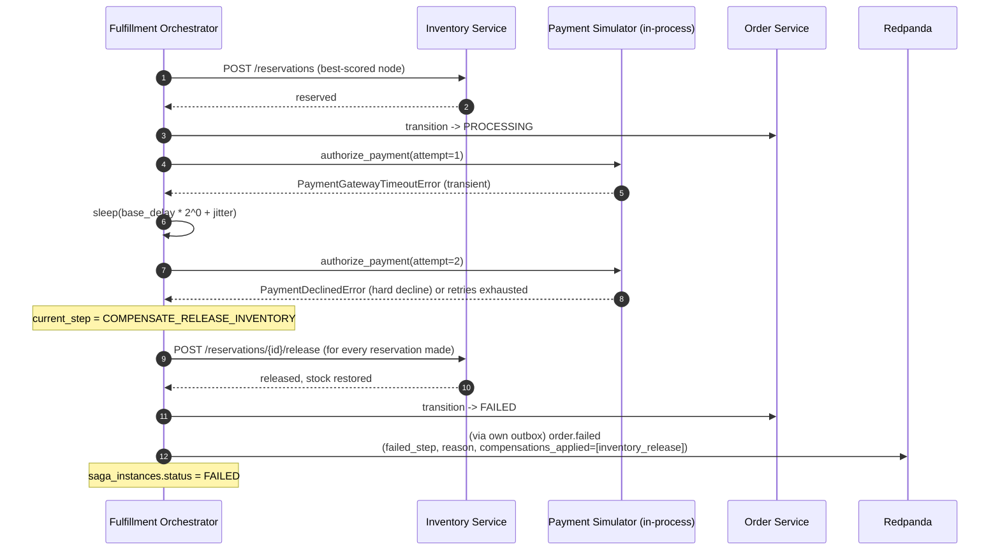
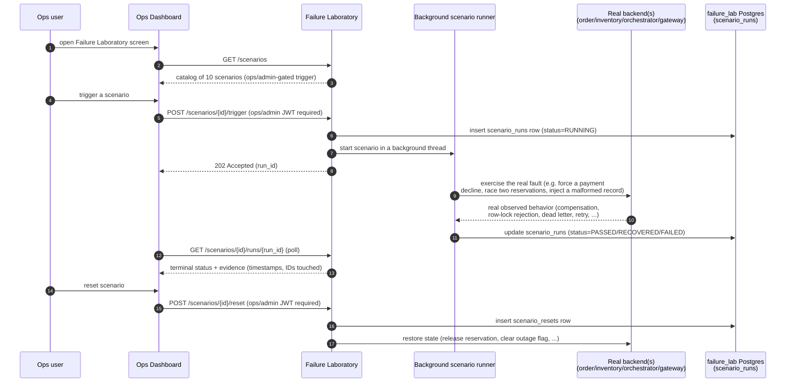
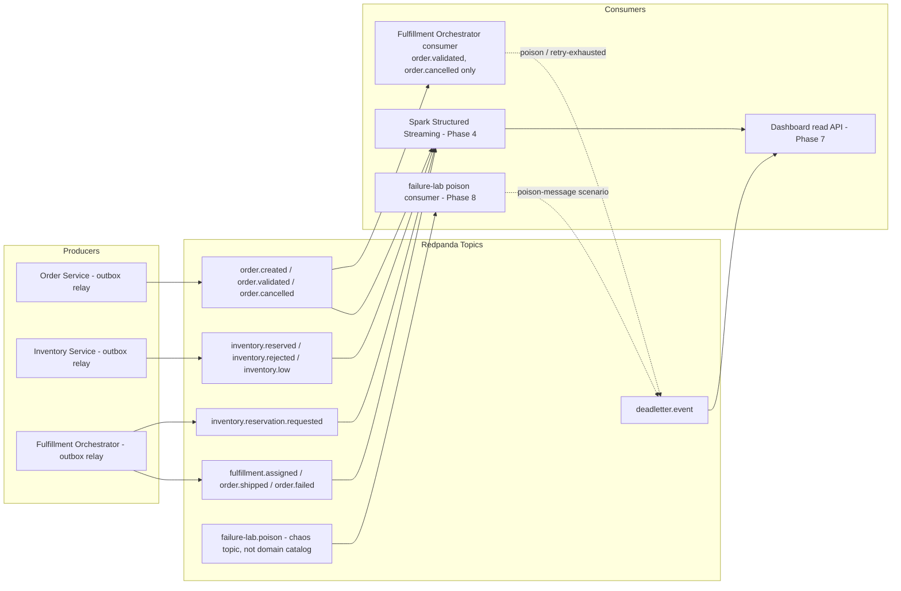
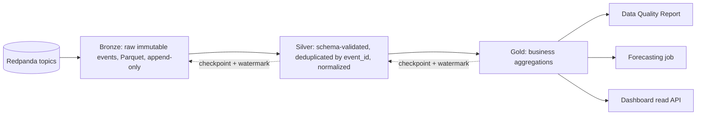
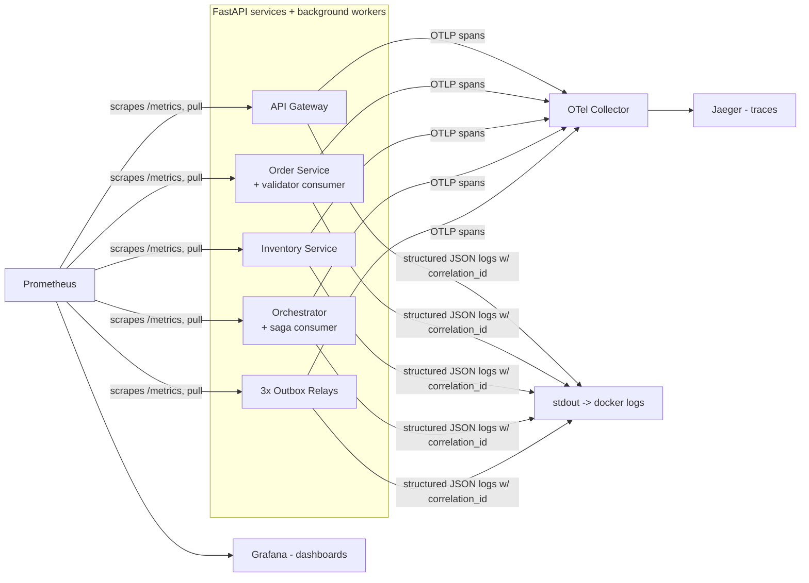

# Architecture

See `docs/system-context.md` for the external view. This document covers the
inside of the boundary: containers/services, the request and event flows
between them, the data pipeline, the AWS deployment target, and the
observability flow. Service boundaries mirror the monorepo layout in
`PROJECT_STATUS.md` / the root `README.md`.

## Container architecture

```mermaid
C4Container
  title OmniFlow — Container Diagram

  Person(customer, "Customer / load generator")
  Person(ops, "Ops user")

  System_Boundary(omniflow, "OmniFlow") {
    Container(gateway, "API Gateway", "FastAPI", "AuthN/Z, validation, rate limiting, correlation IDs, OpenAPI")
    Container(orders, "Order Service", "FastAPI + SQLAlchemy", "Order state machine, idempotency, outbox")
    Container(inventory, "Inventory Service", "FastAPI + SQLAlchemy", "Stock, reservations, row-level locking")
    Container(orchestrator, "Fulfillment Orchestrator", "Python + Kafka consumer", "Saga: node selection, payment sim, compensation")
    Container(payment_sim, "Payment Simulator", "Python module, in-process within the orchestrator", "Deterministic authorize/decline/timeout — not a separate deployable")
    ContainerDb(postgres, "PostgreSQL", "RDBMS", "Orders, inventory, outbox, saga state, users, audit")
    Container(redpanda, "Redpanda", "Kafka-protocol broker", "Domain event bus + DLQ topics")
    Container(outbox_relay, "Outbox Relay", "Python worker", "Polls outbox_events, publishes to Redpanda")
    Container(spark, "Spark Structured Streaming", "PySpark, local[*]", "Bronze/Silver/Gold pipeline")
    ContainerDb(minio, "MinIO", "S3-compatible object store", "Parquet: bronze/silver/gold")
    Container(dq, "Data Quality Runner", "Python + PySpark", "Executable checks, report generation")
    Container(forecast, "Forecasting Job", "Python (scikit-learn/statsmodels)", "Baseline + model, batch")
    Container(dashboard, "Ops Dashboard", "React + TypeScript", "Executive, ops, DQ, forecast, failure-lab UIs")
    Container(failure_lab, "Failure Laboratory", "FastAPI + background-thread runner", "10 deterministic failure scenarios, own Postgres database")
    Container(lag_poller, "Lag Poller", "Python, direct Kafka polling", "Gold dataset #10 — consumer-group lag, no Spark")
    Container(otel_collector, "OTel Collector", "OpenTelemetry", "Trace/metric pipeline")
    ContainerDb(prometheus, "Prometheus", "TSDB", "Metrics")
    Container(grafana, "Grafana", "Dashboards")
    Container(jaeger, "Jaeger", "Trace storage/UI")
  }

  Rel(customer, gateway, "HTTPS/JSON")
  Rel(ops, dashboard, "HTTPS")
  Rel(dashboard, gateway, "REST (read/write) + polling", "HTTPS")
  Rel(dashboard, failure_lab, "trigger/reset scenarios, read runs", "HTTPS")
  Rel(gateway, orders, "REST (internal)")
  Rel(gateway, inventory, "REST (internal, read-only queries)")
  Rel(failure_lab, gateway, "duplicate-order-submit scenario", "REST, service-account JWT")
  Rel(failure_lab, orders, "poison-message / late-event / crash-resume scenarios", "REST + Kafka")
  Rel(failure_lab, inventory, "oversell-race, simulated outage", "REST")
  Rel(failure_lab, orchestrator, "saga-crash-resume, dead-letter replay", "REST")
  Rel(failure_lab, postgres, "scenario_runs, scenario_resets, failure_lab_dead_letters", "SQL")
  Rel(lag_poller, redpanda, "polls committed offsets + watermarks (no consumption)")
  Rel(lag_poller, minio, "writes consumer_lag Parquet snapshots")
  Rel(orders, postgres, "SQL")
  Rel(inventory, postgres, "SQL")
  Rel(orders, outbox_relay, "writes outbox_events row in same TX", "via postgres")
  Rel(outbox_relay, redpanda, "produces events")
  Rel(orchestrator, redpanda, "consumes order.validated/order.cancelled; produces its own events", "Kafka")
  Rel(orchestrator, orders, "GET order, transition status", "REST")
  Rel(orchestrator, inventory, "list nodes, check stock, reserve/release", "REST")
  Rel(orchestrator, payment_sim, "authorize", "in-process call")
  Rel(orchestrator, postgres, "saga_instances", "SQL")
  Rel(spark, redpanda, "consumes all topics")
  Rel(spark, minio, "writes/reads Parquet")
  Rel(dq, minio, "reads Silver/Gold, writes DQ report")
  Rel(forecast, minio, "reads Gold, writes forecast dataset")
  Rel(dashboard, minio, "reads DQ report / forecast / gold summaries", "via a thin read API")
  Rel(gateway, otel_collector, "traces (OTLP)")
  Rel(orders, otel_collector, "traces (OTLP)")
  Rel(inventory, otel_collector, "traces (OTLP)")
  Rel(orchestrator, otel_collector, "traces (OTLP)")
  Rel(outbox_relay, otel_collector, "traces (OTLP)")
  Rel(otel_collector, jaeger, "traces (OTLP)")
  Rel(prometheus, gateway, "scrapes /metrics (pull)")
  Rel(prometheus, orders, "scrapes /metrics (pull)")
  Rel(prometheus, inventory, "scrapes /metrics (pull)")
  Rel(prometheus, orchestrator, "scrapes /metrics (pull)")
  Rel(prometheus, outbox_relay, "scrapes standalone /metrics server (pull)")
  Rel(grafana, prometheus, "queries")
```



**Forecasting Job, as actually built (Phase 6)**: the diagram above sketches
it reading Gold directly; the real implementation
(`services/data-platform/app/forecasting`) reads a deterministic synthetic
history instead — the real `order.created` event payload has no location
field to build a SKU x location grain from, and this repo's live event
volume is too small to evaluate a model meaningfully either way (both
confirmed before building anything, not assumed). It still reads/writes
MinIO under the same bucket, in its own `forecasting/` prefix alongside
`gold/`, not nested inside it. Full detail, including why:
`docs/phase-6-demand-forecasting.md`. The Ops Dashboard, Failure Laboratory,
and Lag Poller containers above were added to this diagram in Phase 13 —
all three were already real, running services (built in Phases 7, 8, and 4
respectively) that this diagram had not been updated to include; see
`RISKS.md` #6.

## Order sequence (happy path)

As built (see ADR 0010): the orchestrator's Kafka consumption is what
*starts* the saga (`order.validated`) and is genuinely idempotent/resumable,
but once running, each step is a direct, synchronous REST call to Order
Service or Inventory Service — not a second event round-trip. Every service
still publishes its full event catalog via its own outbox for the data
platform and dashboard; those publishes are shown but are not what drives
the next step.

```mermaid
sequenceDiagram
  autonumber
  participant C as Customer
  participant GW as API Gateway
  participant OS as Order Service
  participant OBX as Outbox Relay
  participant RP as Redpanda
  participant ORCH as Fulfillment Orchestrator
  participant INV as Inventory Service
  participant PAY as Payment Simulator (in-process)

  C->>GW: POST /orders (Idempotency-Key, correlation-id)
  GW->>OS: create order (validated payload)
  alt key seen before, same hash
    OS-->>GW: 200 (cached response)
  else new key
    OS->>OS: BEGIN; insert order (CREATED); self-validate -> VALIDATED;<br/>outbox: order.created, order.validated; COMMIT
    OS-->>GW: 201 Created (status: CREATED)
    OBX->>RP: publish order.created, order.validated
    RP-->>ORCH: order.validated (saga trigger; idempotent on event_id)
    ORCH->>OS: GET order; transition -> INVENTORY_PENDING
    ORCH->>INV: GET /fulfillment-nodes; POST /stock/check per candidate
    ORCH->>RP: (via own outbox) inventory.reservation.requested
    ORCH->>ORCH: score candidates (ADR 0010)
    ORCH->>INV: POST /reservations (best-scored node, per item)
    INV-->>ORCH: reserved (row-locked; ADR 0002)
    INV->>RP: (via own outbox) inventory.reserved
    ORCH->>OS: transition -> INVENTORY_RESERVED -> FULFILLMENT_ASSIGNED(node_id)
    ORCH->>RP: (via own outbox) fulfillment.assigned
    ORCH->>OS: transition -> PROCESSING
    ORCH->>PAY: authorize_payment(order_total, skus, attempt)
    PAY-->>ORCH: approved
    ORCH->>OS: transition -> SHIPPED
    ORCH->>RP: (via own outbox) order.shipped
    Note over ORCH: saga_instances.status = COMPLETED
  end
```

## Inventory reservation under concurrency

```mermaid
sequenceDiagram
  autonumber
  participant A as Request A (last unit)
  participant B as Request B (last unit)
  participant DB as Postgres (inventory_stock row)

  par concurrent requests for same SKU/node
    A->>DB: BEGIN; SELECT available FOR UPDATE
    B->>DB: BEGIN; SELECT available FOR UPDATE (blocks on A's row lock)
  end
  DB-->>A: available = 1
  A->>DB: UPDATE available -= 1, reserved += 1; COMMIT
  DB-->>B: (lock released) available = 0
  B->>DB: ROLLBACK / reject — insufficient stock
  Note over A,B: Row-level lock (SELECT ... FOR UPDATE) serializes the two<br/>transactions so exactly one reservation succeeds. See ADR 0002.
```

## Saga compensation (failure path)



A parallel path — a customer cancelling the order while the saga is still
`RUNNING` — is handled the same way: the orchestrator consumes
`order.cancelled` (Order Service already moved the order to `CANCELLED`
itself), releases whatever reservations that saga had made, and marks the
saga `FAILED` without calling Order Service again.

## Failure laboratory: trigger / observe / reset flow

The saga-compensation diagram above is one specific failure/recovery path
(a payment decline). Phase 8's failure laboratory (`services/failure-lab`)
generalizes this into 10 deterministic, API-triggered scenarios exercised
against the real running stack — never simulated only in the browser. This
diagram shows the shape every scenario shares; each scenario's own
mechanism differs (see `docs/phase-8-failure-laboratory.md` for all 10).



## Event flow (bus-level view)

As built (ADR 0010): only `order.validated` and `order.cancelled` actually
have a consumer driving saga behavior (the orchestrator). Every other topic
is real and published for the data platform and dashboard to consume —
`SPARK` (Phase 4) and `DASH` (Phase 7, via the orchestrator's read-only
dead-letter API) are both real, running consumers as of Phase 13, not the
future work this diagram originally sketched in Phase 2. `POISON` (Phase 8)
is a separate, dedicated chaos-topic consumer backing the poison-message
scenario, not part of the 11-topic domain event catalog.



## Data pipeline (bronze → silver → gold)



Details (schema evolution, partitioning, backfill/reprocessing, watermarks) are
in `docs/data-pipeline.md`.

## AWS deployment target (Terraform, authored not applied)

Full detail — module structure, IAM, cost drivers, and every documented
limitation (the manual per-service-database bootstrap step, ops-dashboard's
nginx resolver needing an AWS-specific change, EMR Serverless
custom-image compatibility, tracing having no cloud backend wired up):
`infra/terraform/README.md`. Updated in Phase 11 from the Phase 0 sketch
below to include the services/architecture that landed in Phases 7-10
(failure-lab, ops-dashboard) and ADR 0005's own named cloud target for the
data platform (EMR, not just "S3 replaces MinIO").

```mermaid
flowchart TB
  Internet((Internet / Ops user))

  subgraph VPC
    ALB[ALB - host-based routing]
    subgraph "ECS Fargate (Cloud Map private DNS)"
      GWc[API Gateway]
      OSc[Order Service + validator-consumer + outbox-relay]
      INVc[Inventory Service + outbox-relay]
      ORCHc[Fulfillment Orchestrator + consumer + outbox-relay]
      FLc[Failure Laboratory + poison-consumer]
      DASHc[Ops Dashboard]
      LAGc[lag-poller]
    end
    EMR[EMR Serverless - Spark bronze/silver/gold, replaces local[*] Spark]
    RDS[(RDS PostgreSQL - 5 logical databases, 1 master user)]
    Redis[(ElastiCache Redis - modeled for a future shared rate limiter, RISKS.md #13; not yet consumed by app code)]
    MSK[(MSK IAM-auth - managed Kafka, replaces Redpanda)]
  end
  S3[(S3 - replaces MinIO, same bronze/silver/gold/checkpoints/dq-reports/forecasting prefixes)]
  CW[CloudWatch Logs/Metrics/Alarms/Dashboard - replaces local Jaeger/Prometheus/Grafana]
  SM[Secrets Manager - JWT secret, seeded demo-user passwords, RDS master password, DATABASE_URL secrets]
  IAM[IAM roles - least privilege per ECS task + EMR execution role]

  Internet --> ALB
  ALB -->|default Host| GWc
  ALB -->|dashboard_hostname| DASHc
  GWc --> OSc & INVc
  ORCHc --> OSc & INVc
  FLc --> GWc & OSc & INVc & ORCHc
  OSc & INVc & ORCHc & FLc & GWc --> RDS
  OSc & INVc & ORCHc & FLc & LAGc --> MSK
  EMR --> MSK
  EMR --> S3
  LAGc -.writes consumer_lag.-> S3
  GWc & OSc & INVc & ORCHc & FLc & DASHc & LAGc & EMR --> CW
  GWc & OSc & INVc & ORCHc & FLc & LAGc -.reads secrets.-> SM
```

## Observability flow

Traces (push) and metrics (pull) travel through separate paths, per
`services/event-contracts/event_contracts/{tracing,metrics}_setup.py`.
**Traces**: every FastAPI process (including `failure-lab`, added in Phase 8
on the same shared `event_contracts` wiring) and every background worker
(both outbox relays, the order-service validator consumer, the
orchestrator's saga consumer, the failure-lab poison consumer) calls
`configure_tracing`, which exports OTLP spans to the OTel Collector; the
collector forwards them to Jaeger's own OTLP receiver. A
span's context crosses the Kafka boundary through the event envelope's own
`trace_context.traceparent` field (W3C Trace Context) — captured at
`stage_event` time, re-extracted by the outbox relay's publish span and
again by `run_consume_loop`'s consumer span — so one order's HTTP request,
its outbox publish, and every saga step a Kafka event triggers land in the
**same trace** in Jaeger, confirmed end-to-end by `scripts/compose_smoke_test.sh`.
**Metrics**: every FastAPI process serves its own `/metrics` route on its
normal port; every background worker runs a standalone `prometheus_client`
HTTP server on its own port (`METRICS_PORT`, see each service's
`app/config.py`) — Prometheus scrapes all of them directly (pull), never
through the collector. Grafana's one provisioned datasource points at
Prometheus.



## Service boundaries — responsibility summary

| Service | Owns | Does not own |
|---|---|---|
| API Gateway | AuthN/Z, request validation, rate limiting, correlation ID issuance, OpenAPI surface | Business logic, persistence |
| Order Service | Order aggregate, state machine, idempotency keys, outbox | Inventory state, node selection, payment |
| Inventory Service | Stock levels per SKU/node, reservations, concurrency control | Order lifecycle, saga sequencing |
| Fulfillment Orchestrator | Saga state, node scoring, compensation, retry/backoff, DLQ routing | Direct inventory/order table writes (talks via events/REST, not shared tables) |
| Data platform (Spark/DQ/forecast) | Bronze/Silver/Gold, data quality, forecasting | Any transactional write path back into Postgres |
| Dashboard | Presentation, failure-lab triggers | Business rules (reads via APIs, does not reimplement logic client-side) |

## Cross-cutting: correlation and causation

Every inbound request is assigned a `correlation_id` at the API Gateway (or
reuses the caller's, if supplied and well-formed). Every event carries the
`correlation_id` of the request/saga that caused it and a `causation_id` equal
to the `event_id` of whatever directly triggered it — this makes an entire
order's event graph reconstructable from `correlation_id` alone, which is what
the dashboard's order-timeline view and Jaeger traces both rely on.
