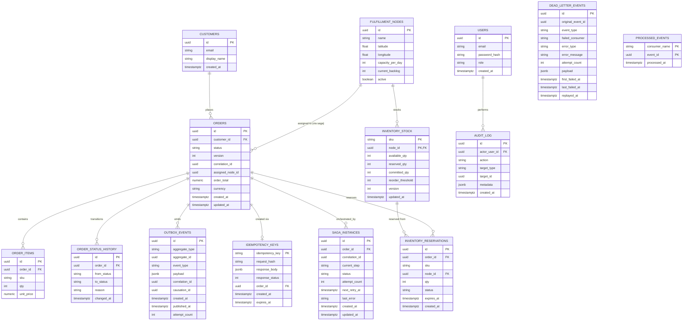

# Data Model

Transactional store is PostgreSQL, owned per-service (Order Service and
Inventory Service each own their tables; no cross-service foreign keys at the
DB level — cross-service references are by ID only, enforced in application
code and checked by data-quality jobs downstream). Migrations are managed with
Alembic, one migration chain per service.

## Entity-relationship diagram

## Notes on key tables

- **`orders.version`** — optimistic concurrency column (ADR 0002). Every
  update does `UPDATE orders SET ..., version = version + 1 WHERE id = :id AND
  version = :expected_version`; zero rows affected means a concurrent writer
  won and the caller retries or fails with 409.
- **`inventory_stock`** — primary key is `(sku, node_id)`. Reservation is a
  single transaction: `SELECT ... FOR UPDATE` on the row, check
  `available_qty >= requested_qty`, then `UPDATE available_qty -=, reserved_qty
  +=` in the same transaction (ADR 0002). `inventory_stock.version` is kept
  too, for audit/debugging, but the lock — not the version check — is what
  prevents overselling.
- **`idempotency_keys`** — checked and written in the same transaction as order
  creation. A retried request with the same key and an identical
  `request_hash` (SHA-256 of the normalized request body) returns the stored
  response verbatim. Same key with a different hash is a `409 Conflict`
  ("idempotency key reused with a different payload"). Rows expire (default
  24h) to bound table growth; expiry does not affect already-completed orders.
- **`outbox_events`** — written in the same DB transaction as the business
  state change it announces (this is what makes "state change + event" atomic
  without two-phase commit across Postgres and Redpanda). The Outbox Relay
  polls `WHERE published_at IS NULL ORDER BY created_at`, publishes, then
  marks `published_at`. `attempt_count` backs its own retry/backoff.
- **`saga_instances`** — one row per order per active saga run; `current_step`
  and `status` let the orchestrator resume a saga after a crash by reading
  this table on startup, rather than relying on in-memory state.
- **`processed_events`** — the idempotent-consumer ledger referenced in
  `docs/event-catalog.md`; composite PK `(consumer_name, event_id)` makes a
  duplicate delivery a no-op insert-conflict rather than a re-applied side effect.

## Cross-service reference integrity

`orders.assigned_node_id` and `inventory_reservations.node_id` reference
`fulfillment_nodes.id`, and `inventory_reservations.order_id` references
`orders.id` — but Inventory and Order are separate services/schemas in this
design, so these are **not** enforced as live SQL foreign keys across service
boundaries; they are validated by (a) application-level checks at write time
and (b) the referential-integrity data-quality check in
`docs/data-pipeline.md` / `docs/testing-strategy.md`, which reconciles Gold
datasets against expected ID spaces.
