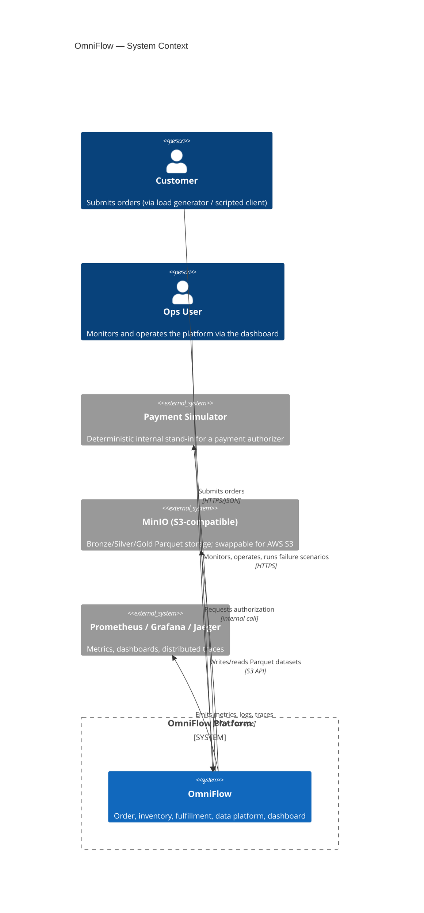

# System Context

OmniFlow as seen from outside its own boundary: who and what it talks to, and
what crosses that boundary. See `docs/architecture.md` for the container-level
breakdown inside the boundary.

## External systems and why they are simulated, not real

| External dependency | Real-world equivalent | Why simulated here |
|---|---|---|
| Payment simulator | Card processor / PSP | No PCI scope, deterministic for tests and failure-lab (can be told to time out, decline, or succeed) |
| Fulfillment nodes | Warehouses/stores | Modeled as configuration + inventory data, not live systems, since the point of the demo is the orchestration logic around them, not carrier integration |
| MinIO | AWS S3 | S3 API-compatible; local swap-in, so the same code path targets real S3 in the Terraform-described cloud deployment |
| Redpanda | Apache Kafka / AWS MSK | Kafka-protocol-compatible; see ADR 0001 |

## Trust boundary

Everything inside the System Boundary box shares one Docker Compose network in
local dev. In the AWS deployment story (`infra/terraform`, not applied), this
boundary maps to a VPC; the only things crossing it are the ALB (customer/ops
traffic in) and CloudWatch/Secrets Manager calls (telemetry and config out).
